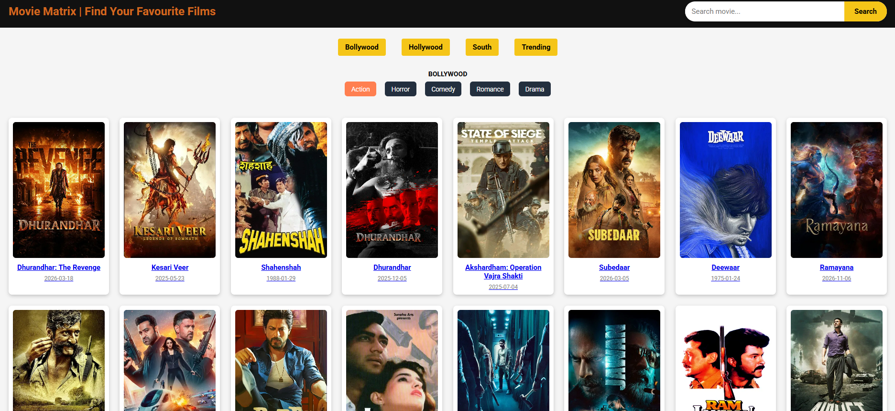
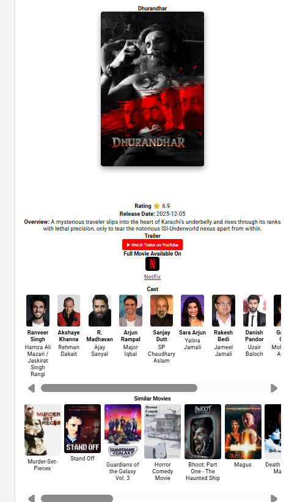
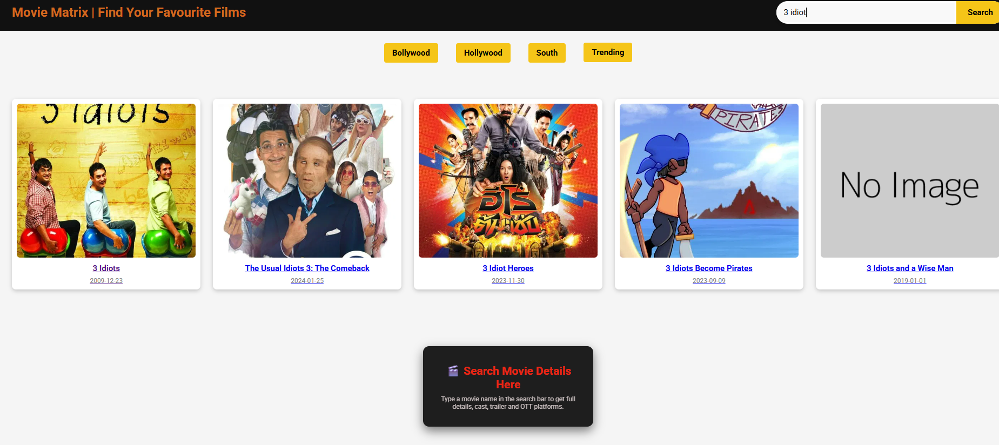

# 🎬 Movie Search App

A simple and interactive movie search web application built using HTML, CSS, and JavaScript. This app allows users to search for movies, view details, watch trailers, and explore movies by genre.

---

## 🚀 Features

* 🔍 Search movies by name
* 🎥 Watch movie trailers
* ⭐ View ratings and overview
* 🎭 Browse movies by genre (Action, Comedy, Horror, Romance, etc.)
* 📺 Check available streaming platforms
* 👥 View cast details

---

## 🛠️ Tech Stack

* HTML
* CSS
* JavaScript
* TMDB API

---

## 📸 Screenshots





---

## 🌐 Live Demo

https://moviematricx.netlify.app/

---

## 📂 Project Structure

```
movie/
│── index.html
│── movie.html
│── script.js
│── movie.js
│── style.css
```

---

## ⚙️ How to Run Locally

1. Download or clone the repository
2. Open the project folder
3. Open `index.html` in your browser

---

## 📌 Future Improvements

* 🔐 User login/signup system
* ❤️ Add to favorites feature
* 📱 Make it fully responsive
* 🎙️ Voice search (like Google mic)

---

## 🙌 Author

* Divyansh Mishra

---

## ⭐ Support

If you like this project, give it a ⭐ on GitHub!
